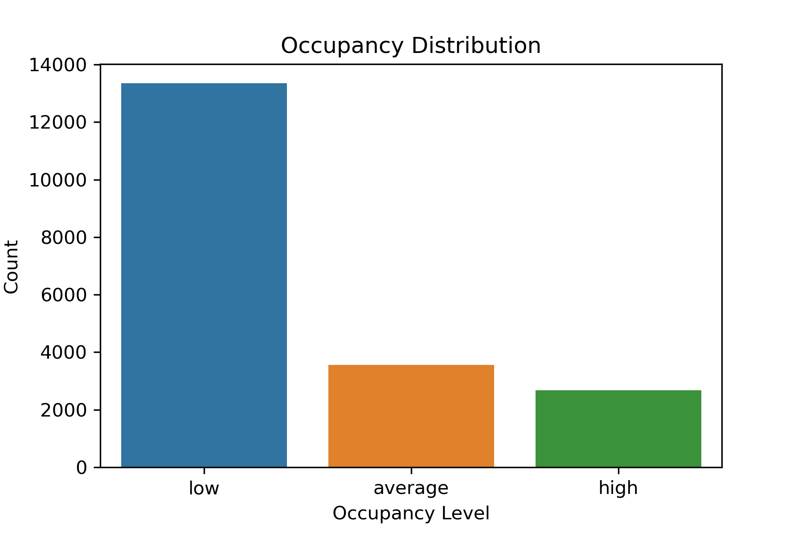

# Airbnb-Classification

# Occupancy rate
This project will analyze the Airbnb listings and identify critical features that mostly affect the occupancy rate of a listing. 
The result of the analysis will help hosts in improving their listings with the most critical features. Achieving higher the occupancy rates  yields highre 
revenues to hosts and to the platform.

The occupancy rates for each listing is estimated as a function of the average number of reviews per month and minimum required nights with the assumption that 30% of the stays writes reviews on the platform.
The distribution of occupancy rates is as follows:

Occupancy level is derived from occupancy rates and divide listings as high, average and low occupancy considering the following industry occupancy levels. 
-- The U.S. average occupancy rate is about 46.% by April, 2021. -- An ideal occupancy rate for hotels is between 70% and 95%.

Below the graph after transformation:

# Classification evaluation metric
Precision is important to categorize the listings correctly. If hosts know, their listings would create high or low occupancy, they would act differently. For example, a host with a low predicted occupancy might invest in various sources and search methods to increase the occupancy rate. So, it is important to provide the right information to the host.

On the other hand, recall is also relevant in this concept. Identifing a high occupancy listing as lower category causes additional costs to the listing host who aims to improve his listings occupancy as well as his profit and might affect adversely the host's revenue from the Airbnb platform. Eventually, this, false negatives, rises the host churn rate from the platform.

The other point need to be considered before picking an evaluation metric is the nature of the target feature. The occupancy level is multiclass and imbalanced. As stated above, I will take a balanced approach between precision and recall with more weight to precision. So, I will use F1 beta metric to evaluate the model performance with an average option 'weighted' to account for label imbalance.
I will also use balanced accuracy to evaluate the models as a second metric. 

The model will be evaluated candidate models using repeated stratified k-fold cross-validation.

Stratified means that each fold will aim to contain the same mixture of examples by class as the entire training dataset. Repeated means that the evaluation process will be performed multiple times to help avoid fluke results and better capture the variance of the chosen model
[link](https://machinelearningmastery.com/imbalanced-multiclass-classification-with-the-glass-identification-dataset/).
